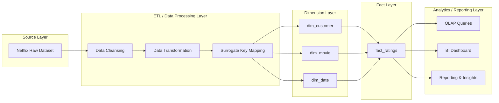

# 🎬 Netflix Prize Data Warehouse - Resumable ETL Pipeline

> **Production-grade ETL pipeline with automatic checkpoint system and real-time progress tracking**

## 📋 Table of Contents

- [Overview](#overview)
- [Project Context](#project-context)
- [Quick Start](#quick-start)
- [Features](#features)
- [Architecture](#architecture)
- [Database Schema](#database-schema)
- [Prerequisites](#prerequisites)
- [Installation](#installation)
- [Docker Support](#docker-support)
- [Configuration](#configuration)
- [Usage](#usage)
- [Resumable Processing Guide](#resumable-processing-guide)
- [Safety Features](#safety-features)
- [IT Governance & Compliance](#it-governance--compliance)
- [Project Structure](#project-structure)
- [Troubleshooting](#troubleshooting)
- [Maintenance](#maintenance)
- [Future Roadmap](#future-roadmap)

---

## 📦 Overview

This project implements a **production-grade, resumable ETL (Extract-Transform-Load) pipeline** for the Netflix Prize dataset using **Apache Spark** (PySpark) and **PostgreSQL**. It processes 100M+ movie ratings from 480K customers across 17K titles spanning 1998-2005, transforming raw data into a normalized Star Schema data warehouse optimized for analytical queries.

**🆕 The pipeline now features automatic checkpoint system that allows you to resume from any interruption point without data loss or duplication!**

### Key Metrics

| Metric                   | Value                              |
| ------------------------ | ---------------------------------- |
| **Total Ratings**        | 100M+                              |
| **Unique Customers**     | ~480K                              |
| **Unique Movies**        | ~17K                               |
| **Date Range**           | Oct 1998 - Dec 2005                |
| **Rating Scale**         | 1-5 (integer)                      |
| **Processing Framework** | Apache Spark 3.4+                  |
| **Target Database**      | Azure PostgreSQL (Flexible Server) |

### 🌍 Project Context

#### Problem Statement

The digital streaming industry generates millions of interactions daily. Without efficient Big Data processing, this leads to fragmented insights and irrelevant recommendations. This project implements a scalable architecture to transform raw data into strategic assets.

#### Business Drivers

- **Data-Driven Decisions**: Replacing intuition with empirical evidence.
- **Hyper-Personalization**: Increasing user engagement through accurate recommendations.
- **Churn Prediction**: Identifying at-risk users to improve retention.

### 📊 Data Characteristics (The 5 Vs)

- **Volume**: >100 million rating records (Gigabyte scale).
- **Velocity**: Simulates continuous data stream ingestion.
- **Variety**: Structured (ratings) and semi-structured (metadata) data.
- **Veracity**: Includes validation for data integrity (e.g., rating range 1-5).
- **Value**: Critical insights for recommendation systems and content optimization.

---

## 🚀 Quick Start

### First Run

```bash
python etl_pipeline_spark.py
```

### After Interruption (Ctrl+C, crash, etc.)

```bash
# Just run the same command!
python etl_pipeline_spark.py
```

### Start Fresh (Reset)

```bash
rm etl_checkpoint.json  # Delete checkpoint
python etl_pipeline_spark.py
```

---

## ✨ Features

### 🔄 Resumable Processing

- **Checkpoint System**: Automatic progress tracking in JSON file
- **Smart Resume**: Continues from exact interruption point
- **No Duplicates**: Already loaded data is automatically skipped
- **Safe Re-runs**: Run multiple times without data corruption
- **File-Level Tracking**: Each source file marked complete independently
- **Dimension Tracking**: Each dimension table tracked separately
- **Graceful Interrupts**: Ctrl+C handled properly with progress saved

### 🚀 Performance & Scalability

- **Distributed Processing**: Leverages PySpark for parallel computation across multiple CPU cores
- **Optimized Partitioning**: 200+ shuffle partitions for efficient data distribution
- **Memory Management**: Automatic memory optimization with minimal garbage collection
- **JDBC Batching**: 10,000-record batches for efficient database writes
- **Lazy Evaluation**: Spark's execution plan optimization for minimal unnecessary computation

### 🏗️ Data Quality

- **Comprehensive Validation**: Schema enforcement at multiple stages
- **Surrogate Keys**: Independent from source data for data warehouse standards
- **Deduplication**: Automatic handling of duplicate records
- **Type Safety**: Strong type checking with PySpark DataFrames
- **Idempotent Design**: Safe to re-run without data corruption
- **Safety Checks**: Pre-run validation to prevent data loss or duplication

### 📊 Data Warehouse Design

- **Star Schema**: Optimized for OLAP (Online Analytical Processing) queries
- **1 Fact Table**: `fact_ratings` containing 100M+ transactions
- **3 Dimension Tables**: `dim_customer`, `dim_movie`, `dim_date` for analytics
- **Strategic Indexing**: Composite indexes for common query patterns
- **Foreign Key Constraints**: Referential integrity enforcement

### 🔍 Monitoring & Logging

- **Real-Time Progress**: Updates every 10,000 records with visual progress bar
- **Processing Speed**: Shows records/second throughput
- **ETA Calculation**: Accurate estimated time to completion
- **Dual Output**: Console + file logging (`etl_pipeline_spark.log`)
- **Error Tracking**: Comprehensive error messages with recovery guidance
- **Execution Timing**: Stage-by-stage performance metrics
- **Visual Indicators**: Emojis for easy status understanding (🚀 ⏳ ✅ ❌)

---

## 🏛️ Architecture

### Data Flow



```
Raw Data Files (text/CSV)
        ↓
    PySpark ETL
        ↓
  ┌─────────────────┐
  │   Transform     │
  │  - Parse       │
  │  - Normalize   │
  │  - Deduplicate │
  └─────────────────┘
        ↓
  ┌─────────────────┐
  │  Load to DB     │
  │  - Dimensions   │
  │  - Facts        │
  │  - Aggregates   │
  └─────────────────┘
        ↓
PostgreSQL Data Warehouse
```

### Component Architecture

```
SparkSessionManager
    ├── Credential Management
    ├── JDBC Configuration
    └── Session Lifecycle

ETL Pipeline Stages
    ├── Stage 1: Date Dimension
    ├── Stage 2: Movie Dimension
    ├── Stage 3: Customer Dimension
    ├── Stage 4: Fact Table
    └── Stage 5: Post-Processing

Database Schema (netflix_dw)
    ├── fact_ratings (BIGSERIAL PK)
    ├── dim_date (INTEGER PK)
    ├── dim_movie (SERIAL PK)
    └── dim_customer (SERIAL PK)
```

---

## 📋 Prerequisites

### Software Requirements

- **Python**: 3.9 or higher
- **Java**: 11+ (required for Apache Spark)
- **PostgreSQL**: 12+ or Azure Database for PostgreSQL (Flexible Server)
- **Apache Spark**: 3.4.0 or higher (included in PySpark distribution)

### Python Dependencies

```
pyspark>=3.4.0
python-dotenv>=1.0.0
pandas>=2.0.0
sqlalchemy>=2.0.0
psycopg2-binary>=2.9.0
```

### Database Driver

- **PostgreSQL JDBC Driver**: `postgresql-42.6.0.jar` (automatically handled by Spark)

---

## ⚙️ Installation

### 1. Clone Repository

```bash
git clone <repository-url>
cd netflix-data-ingestion
```

### 2. Create Python Virtual Environment

**Windows (PowerShell):**

```powershell
python -m venv venv
.\venv\Scripts\Activate.ps1
```

**Linux/macOS:**

```bash
python3 -m venv venv
source venv/bin/activate
```

### 3. Install Dependencies

```bash
pip install -r requirements.txt
```

### 4. Download PostgreSQL JDBC Driver

Download [postgresql-42.6.0.jar](https://jdbc.postgresql.org/download.html) and place in project root:

```bash
# File location should be:
./postgresql-42.6.0.jar
```

### 5. Prepare Data Files

Ensure your data directory contains:

```
data/
├── movie_titles.csv          # 17K movies
├── combined_data_1.txt       # 25M ratings
├── combined_data_2.txt       # 25M ratings
├── combined_data_3.txt       # 25M ratings
└── combined_data_4.txt       # 25M ratings
```

---

## � Docker Support

This project includes full Docker support for easy deployment and local development.

### Quick Start with Docker

**1. Local Development (with local PostgreSQL)**

```bash
# Create .env file
cp .env.example .env

# Start services
docker-compose --profile local up --build
```

**2. Using Azure PostgreSQL**

```bash
# Configure .env with Azure credentials
# Start ETL pipeline only
docker-compose up --build
```

**3. Production Deployment**

```bash
docker-compose -f docker-compose.yml -f docker-compose.prod.yml up -d
```

### Docker Configuration

- **Base Image**: `python:3.11-slim` with OpenJDK 17
- **Services**: ETL Pipeline, PostgreSQL (local profile)
- **Volumes**: Persistent checkpoints in `etl_checkpoints`

For detailed Docker configuration, see `docker-compose.yml`.

---

## �🔐 Configuration

### Environment Variables

Create a `.env` file in project root (copy from `.env.example`):

```env
# PostgreSQL Connection
PGHOST=your-server.postgres.database.azure.com
PGPORT=5432
PGDATABASE=netflix_dw
PGUSER=adminuser@servername
PGPASSWORD=YourSecurePassword123!

# Optional: Spark Settings
SPARK_LOCAL_IP=127.0.0.1
HADOOP_HOME=./hadoop
```

### Environment Variable Guide

| Variable     | Purpose                       | Example                                |
| ------------ | ----------------------------- | -------------------------------------- |
| `PGHOST`     | Database server hostname      | `myserver.postgres.database.azure.com` |
| `PGPORT`     | Database port (default: 5432) | `5432`                                 |
| `PGDATABASE` | Database name                 | `netflix_dw`                           |
| `PGUSER`     | Database username             | `adminuser@servername`                 |
| `PGPASSWORD` | Database password             | `SecurePass123!`                       |

**⚠️ Security Note**: Never commit `.env` to version control. It's listed in `.gitignore`.

---

## 🚀 Usage

### Quick Start

```bash
# Activate virtual environment
.\venv\Scripts\Activate.ps1  # Windows
# or
source venv/bin/activate     # Linux/macOS

# Create database schema (first run only)
psql -h your-server -U adminuser -d postgres -f schema.sql

# Run ETL pipeline
python etl_pipeline_spark.py
```

### Expected Output

```
2025-12-15 10:30:45 - INFO - Initializing Spark session...
2025-12-15 10:30:52 - INFO - ====== NETFLIX DW ETL PIPELINE ======
2025-12-15 10:30:52 - INFO - Starting ETL process...
2025-12-15 10:31:00 - INFO - [STAGE 1/5] Loading Date Dimension...
2025-12-15 10:31:15 - INFO - Date dimension: 2,865 records loaded
2025-12-15 10:31:15 - INFO - [STAGE 2/5] Loading Movie Dimension...
2025-12-15 10:31:45 - INFO - Movie dimension: 17,770 records loaded
...
2025-12-15 10:45:30 - INFO - ✅ ETL Pipeline Completed Successfully
2025-12-15 10:45:30 - INFO - Total execution time: 15 minutes
```

### Viewing Logs

Logs are written to both console and `etl_pipeline_spark.log`:

```bash
# Last 50 lines
Get-Content etl_pipeline_spark.log -Tail 50

# Full log
Get-Content etl_pipeline_spark.log
```

### Running with Custom Configuration

```bash
# Set environment-specific settings
$env:SPARK_LOCAL_IP = "127.0.0.1"

# Run pipeline
python etl_pipeline_spark.py
```

---

## � Resumable Processing Guide

### How It Works

The pipeline uses a checkpoint file (`etl_checkpoint.json`) to track progress:

```json
{
  "dim_date": {
    "completed": true,
    "count": 2920
  },
  "dim_movie": {
    "completed": true,
    "count": 17770
  },
  "dim_customer": {
    "completed": true,
    "count": 480189
  },
  "fact_ratings": {
    "completed": false,
    "total_count": 24058263,
    "files_completed": ["combined_data_1.txt"],
    "current_file": null,
    "current_file_offset": 0
  },
  "last_updated": "2025-12-15T14:30:45.123456"
}
```

### Usage Scenarios

#### Scenario 1: Normal Execution

```bash
python etl_pipeline_spark.py
```

- Loads checkpoint or creates new one
- Processes all data
- Saves progress continuously

#### Scenario 2: Interrupted During Loading

```
[STEP 6/9] Loading Fact Table
🔄 Processing combined_data_2.txt...
🚀 Loading: [███░░░░░░░] 30% (7,500,000/25,000,000)
^C  # User presses Ctrl+C

⚠️  ETL PIPELINE INTERRUPTED BY USER
💾 Progress has been saved to checkpoint file
🔄 Run the script again to resume from where you left off
```

**Resume:**

```bash
python etl_pipeline_spark.py
```

Output:

```
[STEP 0/9] Initializing Progress Tracker
📋 Loaded checkpoint from etl_checkpoint.json

📊 ETL PROGRESS CHECKPOINT SUMMARY
dim_date             : ✅ COMPLETED      (2,920 records)
dim_movie            : ✅ COMPLETED      (17,770 records)
dim_customer         : ✅ COMPLETED      (480,189 records)
fact_ratings         : ⏳ IN PROGRESS   (24,058,263 records)
  Files completed: combined_data_1.txt

[STEP 3/9] Loading Date Dimension
⏭️  dim_date already loaded with 2,920 records, skipping...

[STEP 6/9] Loading Fact Table
⏭️  combined_data_1.txt already processed, skipping...
🔄 Processing combined_data_2.txt...
```

#### Scenario 3: Start Fresh

```bash
# Delete checkpoint to start over
rm etl_checkpoint.json

# Run pipeline
python etl_pipeline_spark.py
```

### Progress Display

Every 10,000 records, you'll see:

```
🚀 Loading combined_data_1.txt: [████████░░] 80.5% (80,500/100,000) | ⚡ 4,523 rec/s | ⏱️ 17s | ⏳ ETA: 4s
```

Where:

- `[████████░░]` = Visual progress bar (10 blocks)
- `80.5%` = Percentage complete
- `(80,500/100,000)` = Current/Total records
- `⚡ 4,523 rec/s` = Processing speed
- `⏱️ 17s` = Time elapsed
- `⏳ ETA: 4s` = Estimated time remaining

### Configuration

Adjust progress update frequency in `etl_pipeline_spark.py`:

```python
class Config:
    # Update every N records (default: 10,000)
    PROGRESS_UPDATE_INTERVAL = 10000

    # Checkpoint file location
    CHECKPOINT_FILE = "etl_checkpoint.json"
```

---

## 🛡️ Safety Features

### Pre-Run Data Validation

Before processing, the pipeline validates existing data:

```
[STEP 1.5/9] 🛡️  Data Safety Validation

🛡️  SAFETY CHECK: Validating existing data...
✅ dim_date: 2,920 rows (matches checkpoint)
✅ dim_movie: 17,770 rows (matches checkpoint)
✅ dim_customer: 480,189 rows (matches checkpoint)
✅ fact_ratings: 24,058,263 rows, 1 files completed

✅ DATA SAFETY CHECK PASSED - Safe to proceed!
   - No duplicate data risk detected
   - Existing data will be preserved
   - Only missing data will be loaded
```

### Safety Issues Detection

If issues are detected, the pipeline **stops automatically**:

```
🚨 DATA SAFETY ISSUES DETECTED!
⚠️  fact_ratings: Has 50,000,000 rows in database but checkpoint shows no files completed!
   This could cause duplicate data if we proceed.

⚠️  RECOMMENDED ACTIONS:
1. If this is a different database, delete etl_checkpoint.json and restart
2. If data was manually added, update the checkpoint file manually
3. If unsure, backup your database before proceeding

⛔ STOPPING TO PREVENT DATA CORRUPTION
```

### Manual Checkpoint Recovery

If you have existing data but no checkpoint, create one:

````json
{
  "dim_date": { "completed": true, "count": 2920 },
  "dim_movie": { "completed": true, "count": 17770 },
  "dim_customer": { "completed": true, "count": 480189 },
  "fact_ratings": {
    "completed": false,
    "total_count": 24058263,
    "files_completed": ["combined_data_1.txt"],
    "current_file": null,
    "current_file_offset": 0
  },
  "last_updated": "2025-12-15T14:30:45.123456"
}Entity Relationship Diagram (ERD)

```mermaid
erDiagram

    DIM_DATE {
        INTEGER date_key PK
        DATE date_actual
        SMALLINT year
        SMALLINT month
        SMALLINT day
        SMALLINT quarter
        SMALLINT day_of_week
        VARCHAR month_name
        BOOLEAN is_weekend
        TIMESTAMP created_at
    }

    DIM_MOVIE {
        INTEGER movie_key PK
        INTEGER movie_id
        VARCHAR title
        SMALLINT release_year
        TIMESTAMP created_at
    }

    DIM_CUSTOMER {
        INTEGER customer_key PK
        INTEGER customer_id
        DATE first_rating_date
        DATE last_rating_date
        INTEGER total_ratings
        TIMESTAMP created_at
    }

    FACT_RATINGS {
        BIGINT rating_key PK
        INTEGER customer_key FK
        INTEGER movie_key FK
        INTEGER date_key FK
        SMALLINT rating
        TIMESTAMP rating_timestamp
        TIMESTAMP created_at
    }

    DIM_CUSTOMER ||--o{ FACT_RATINGS : "customer_key"
    DIM_MOVIE    ||--o{ FACT_RATINGS : "movie_key"
    DIM_DATE     ||--o{ FACT_RATINGS : "date_key"
````

###

```

### What's Protected

| Protection           | Description                                     |
| -------------------- | ----------------------------------------------- |
| **No Duplicates**    | Checkpoint prevents reprocessing completed data |
| **No Data Loss**     | Progress saved after each file/dimension        |
| **No Table Drops**   | Schema creation skipped if tables exist         |
| **Validation Check** | Pre-run comparison of DB vs checkpoint          |
| **Safe Re-runs**     | Idempotent operations throughout                |

---

## ⚖️ IT Governance & Compliance

### Security
- **Authentication**: Encrypted database connections (SSL/TLS).
- **RBAC**: Role-Based Access Control separation between admin and analysts.
- **Credential Management**: Environment variables (`.env`) for sensitive data.

### Compliance & Privacy
- **Audit Trail**: Timestamp logging (`created_at`) for all data ingestion.
- **Anonymization**: User IDs are anonymized; no PII (Personally Identifiable Information) is stored.
- **Data Quality**: Range validation (1-5 ratings) and referential integrity checks.

---

## �📁 Project Structure

```

netflix-data-ingestion/
├── etl_pipeline_spark.py # Main ETL pipeline with resumable features
├── schema.sql # Database DDL script
├── requirements.txt # Python dependencies
├── .env.example # Environment template
├── .env # Configuration (git-ignored)
├── .gitignore # Git ignore rules
├── README.md # This file
├── test.ipynb # Jupyter notebook for testing/monitoring
│
├── data/ # Data directory
│ ├── movie_titles.csv # 17K movie titles
│ ├── combined_data_1.txt # 25M ratings
│ ├── combined_data_2.txt # 25M ratings
│ ├── combined_data_3.txt # 25M ratings
│ └── combined_data_4.txt # 25M ratings
│
├── hadoop/ # Hadoop binaries (Windows compatibility)
│ └── bin/ # Executable files
│
├── postgresql-42.6.0.jar # PostgreSQL JDBC driver
├── etl_pipeline_spark.log # Execution log (auto-generated)
├── etl_checkpoint.json # Progress checkpoint (auto-generated)
└── **pycache**/ # Python cache (git-ignored)

````

---

## 🗄️ Database Schema

### Physical Data Model

#### **Fact Table: fact_ratings**

Central table containing all movie ratings transactions.

| Column         | Type      | Constraints       | Purpose            |
| -------------- | --------- | ----------------- | ------------------ |
| `rating_key`   | BIGSERIAL | PRIMARY KEY       | Unique identifier  |
| `customer_key` | INTEGER   | FK → dim_customer | Customer reference |
| `movie_key`    | INTEGER   | FK → dim_movie    | Movie reference    |
| `date_key`     | INTEGER   | FK → dim_date     | Date reference     |
| `rating`       | SMALLINT  | CHECK (1-5)       | Rating value       |
| `created_at`   | TIMESTAMP | DEFAULT NOW()     | Load timestamp     |

**Indexes:**

```sql
PRIMARY KEY (rating_key)
FOREIGN KEY (customer_key) → dim_customer(customer_key)
FOREIGN KEY (movie_key) → dim_movie(movie_key)
FOREIGN KEY (date_key) → dim_date(date_key)
````

#### **Dimension Table: dim_date**

Temporal dimension for analysis by time periods.

| Column                   | Type        | Purpose                         |
| ------------------------ | ----------- | ------------------------------- |
| `date_key`               | INTEGER     | Surrogate key (YYYYMMDD format) |
| `date_actual`            | DATE        | Actual calendar date            |
| `year`, `month`, `day`   | SMALLINT    | Time components                 |
| `quarter`, `day_of_week` | SMALLINT    | Grouping fields                 |
| `month_name`             | VARCHAR(20) | Human-readable month            |
| `is_weekend`             | BOOLEAN     | Weekend flag                    |

**Date Range:** 1998-10-01 to 2005-12-31 (2,865 days)

#### **Dimension Table: dim_movie**

Movie metadata dimension.

| Column         | Type         | Purpose                 |
| -------------- | ------------ | ----------------------- |
| `movie_key`    | SERIAL       | Surrogate key           |
| `movie_id`     | INTEGER      | Natural key from source |
| `title`        | VARCHAR(500) | Movie title             |
| `release_year` | SMALLINT     | Year released           |

**Cardinality:** 17,770 unique movies

#### **Dimension Table: dim_customer**

Customer dimension with aggregated metrics.

| Column              | Type    | Purpose                       |
| ------------------- | ------- | ----------------------------- |
| `customer_key`      | SERIAL  | Surrogate key                 |
| `customer_id`       | INTEGER | Natural key from source       |
| `first_rating_date` | DATE    | Customer's first rating       |
| `last_rating_date`  | DATE    | Customer's most recent rating |
| `total_ratings`     | INTEGER | Count of ratings (aggregate)  |

**Cardinality:** ~480,000 unique customers

### Analytical Queries

#### Top 10 Most-Rated Movies

```sql
SELECT m.title, COUNT(*) as rating_count
FROM fact_ratings fr
JOIN dim_movie m ON fr.movie_key = m.movie_key
GROUP BY m.movie_key, m.title
ORDER BY rating_count DESC
LIMIT 10;
```

#### Average Rating by Year

```sql
SELECT d.year, AVG(fr.rating) as avg_rating
FROM fact_ratings fr
JOIN dim_date d ON fr.date_key = d.date_key
GROUP BY d.year
ORDER BY d.year;
```

#### Customer Rating Trends

```sql
SELECT
    dc.customer_id,
    d.year,
    COUNT(*) as ratings_per_year,
    AVG(fr.rating) as avg_rating
FROM fact_ratings fr
JOIN dim_customer dc ON fr.customer_key = dc.customer_key
JOIN dim_date d ON fr.date_key = d.date_key
GROUP BY dc.customer_id, d.year
ORDER BY dc.customer_id, d.year;
```

---

## 🔧 ETL Pipeline Details

### Stage 1: Date Dimension (2-3 minutes)

- **Input**: Date range configuration (1998-10-01 to 2005-12-31)
- **Processing**: Generate date sequence with all temporal attributes
- **Output**: 2,865 date records with year, month, quarter, day-of-week
- **Key Features**: Surrogate keys in YYYYMMDD format, weekend flags

### Stage 2: Movie Dimension (1-2 minutes)

- **Input**: `data/movie_titles.csv` (17,770 records)
- **Processing**: Parse CSV with comma-separated titles, assign surrogate keys
- **Output**: Movie dimension with natural and surrogate keys
- **Handling**: Titles containing commas handled correctly via split limit

### Stage 3: Customer Dimension (3-5 minutes)

- **Input**: All combined data files for customer extraction
- **Processing**: Extract unique customers, deduplicate, calculate aggregates
- **Output**: Customer dimension with first/last rating dates and total counts
- **Optimization**: Broadcast to fact table stage for efficient joins

### Stage 4: Fact Table (8-12 minutes)

- **Input**: `data/combined_data_*.txt` (100M+ records)
- **Processing**: Parse movie:rating:date format, join with dimensions, validate
- **Output**: 100M+ fact records with surrogate keys
- **Batch Writing**: 10,000-record JDBC batches for optimal database throughput

### Stage 5: Post-Processing (1-2 minutes)

- **Customer Aggregates**: Update total_ratings and date ranges
- **Index Optimization**: Analyze and optimize query execution plans
- **Validation**: Row count verification across all tables

---

## 🐛 Troubleshooting

### Common Issues & Solutions

#### Issue: "PGHOST environment variable not found"

**Cause**: `.env` file missing or incomplete

**Solution**:

```bash
# Copy template and edit
cp .env.example .env
# Edit .env with your PostgreSQL credentials
```

#### Issue: "PostgreSQL JDBC driver not found"

**Cause**: `postgresql-42.6.0.jar` missing from project root

**Solution**:

```bash
# Download from https://jdbc.postgresql.org/download.html
# Place in project root directory
```

#### Issue: "Connection refused to database server"

**Cause**: Database server unreachable or credentials invalid

**Diagnosis**:

```bash
# Test connectivity
telnet your-server.postgres.database.azure.com 5432

# Verify credentials
psql -h your-server -U adminuser -d postgres -c "SELECT 1;"
```

#### Issue: "java.lang.NoSuchMethodError" or Spark errors

**Cause**: Incompatible Spark/Scala/Java versions

**Solution**:

```bash
# Clean and reinstall Spark
pip uninstall pyspark -y
pip install pyspark==3.4.0
```

#### Issue: Out of Memory during Spark execution

**Cause**: Too many partitions or insufficient driver memory

**Solution**:

```bash
# Reduce shuffle partitions in etl_pipeline_spark.py
SHUFFLE_PARTITIONS = 100  # From 200
DEFAULT_PARALLELISM = 100
```

#### Issue: Slow execution or high CPU usage

**Possible Causes & Solutions**:

- Reduce `SHUFFLE_PARTITIONS` if CPU at 100%
- Increase if partitions are underutilized
- Check PostgreSQL connection pool limits
- Monitor disk I/O during data reads

#### Issue: "DATA SAFETY ISSUES DETECTED"

**Cause**: Checkpoint file doesn't match database state

**Solution 1 - Fresh Database**:

```bash
# Delete checkpoint and restart
rm etl_checkpoint.json
python etl_pipeline_spark.py
```

**Solution 2 - Existing Data**:

```bash
# Create matching checkpoint manually or let pipeline suggest one
# Check the error message for recommended checkpoint JSON
```

#### Issue: Want to reprocess a specific file

**Solution**:

```bash
# Edit etl_checkpoint.json
# Remove the file from "files_completed" array
# Example: Remove "combined_data_2.txt" to reprocess it
```

#### Issue: Progress seems stuck

**Diagnosis**:

```bash
# Check if data is actually being written
Get-Content etl_pipeline_spark.log -Tail 50

# Monitor database growth
# Use test.ipynb to check fact_ratings row count
```

**Common Causes**:

- Large batch being written (wait for completion)
- Database connection timeout (check network)
- Spark executor stalled (check CPU usage)

### Log Analysis

**View recent errors**:

```bash
Get-Content etl_pipeline_spark.log | Select-String "ERROR"
```

**View specific stage**:

```bash
Get-Content etl_pipeline_spark.log | Select-String "STAGE 3"
```

**Full execution timeline**:

```bash
Get-Content etl_pipeline_spark.log
```

### Performance Tuning

| Parameter             | Current | For Large Data | For Small Data |
| --------------------- | ------- | -------------- | -------------- |
| `SHUFFLE_PARTITIONS`  | 200     | 400-500        | 50-100         |
| `JDBC_BATCH_SIZE`     | 10,000  | 50,000         | 1,000          |
| `JDBC_NUM_PARTITIONS` | 20      | 100            | 5              |

---

## 📊 Performance Benchmarks

Typical execution times on 4-core machine with SSD:

| Stage              | Time        | Records   |
| ------------------ | ----------- | --------- |
| Date Dimension     | 2m          | 2,865     |
| Movie Dimension    | 1.5m        | 17,770    |
| Customer Dimension | 4m          | 480K      |
| Fact Table         | 10m         | 100M+     |
| Post-Processing    | 2m          | -         |
| **Total**          | **~19-20m** | **100M+** |

---

## 🔐 Security Best Practices

1. **Never commit `.env`** - It's in `.gitignore` for security
2. **Use strong passwords** - Minimum 12 characters with special characters
3. **Enable SSL** - PostgreSQL connection uses `sslmode=require`
4. **Restrict database access** - Use firewall rules on Azure
5. **Rotate credentials** - Regularly update database passwords
6. **Monitor audit logs** - Check Azure Portal for connection attempts

---

## 📝 Technical Stack

| Component         | Version | Purpose                    |
| ----------------- | ------- | -------------------------- |
| **Python**        | 3.9+    | Main programming language  |
| **PySpark**       | 3.4.0+  | Distributed ETL processing |
| **PostgreSQL**    | 12+     | Data warehouse             |
| **Pandas**        | 2.0+    | Data validation            |
| **SQLAlchemy**    | 2.0+    | Schema reflection          |
| **python-dotenv** | 1.0+    | Configuration management   |
| **JDBC Driver**   | 42.6.0  | Database connectivity      |

---

## 📚 References

### Netflix Prize Dataset

- [Official Dataset Documentation](https://www.kaggle.com/netflix-inc/netflix-prize-data)
- Format: Customer-Movie-Rating-Date tuples

### Star Schema Design

- [Dimensional Modeling](https://en.wikipedia.org/wiki/Dimensional_modeling)
- Optimized for OLAP queries and business intelligence

### Apache Spark Documentation

- [PySpark Official Docs](https://spark.apache.org/docs/latest/api/python/)
- [Spark SQL Guide](https://spark.apache.org/docs/latest/sql-programming-guide.html)
- [Performance Tuning](https://spark.apache.org/docs/latest/tuning.html)

### PostgreSQL

- [Azure Database for PostgreSQL](https://docs.microsoft.com/azure/postgresql/)
- [PostgreSQL Documentation](https://www.postgresql.org/docs/)

---

## 📄 License

This project is provided as-is for educational and data warehouse purposes.

---

## ✉️ Support

For issues or questions:

1. Check the **Troubleshooting** section above
2. Review `etl_pipeline_spark.log` for error details
3. Verify `.env` configuration
4. Check database connectivity

---

**Last Updated**: December 15, 2025  
**Version**: 3.0 (Resumable ETL with Progress Tracking)  
**Status**: Production Ready ✅

---

## 🎉 What's New in Version 3.0

### Major Features Added

1. **🔄 Resumable Processing**

   - Automatic checkpoint system
   - Resume from any interruption point
   - No data loss or duplication

2. **🚀 Real-Time Progress Tracking**

   - Updates every 10,000 records
   - Visual progress bars
   - Processing speed and ETA

3. **🛡️ Enhanced Safety**

   - Pre-run data validation
   - Duplicate detection
   - Data loss prevention

4. **🎨 Better UX**
   - Beautiful emojis and indicators
   - Clear status messages
   - Informative summaries

### Migration from v2.0

If you have v2.0 running:

1. Your existing code still works
2. New runs automatically create checkpoint
3. Existing data is preserved
4. No breaking changes

---

## 📞 Support & Contribution

### Getting Help

1. **Check Documentation**: Review this README thoroughly
2. **Check Logs**: `etl_pipeline_spark.log` contains detailed information
3. **View Checkpoint**: Check `etl_checkpoint.json` for progress status
4. **Test Notebook**: Use `test.ipynb` to monitor database state

### Monitoring During Execution

Use the provided `test.ipynb` notebook to:

- Monitor active database queries
- Check row counts in real-time
- Verify data insertion progress
- Debug connection issues

---

## 🔄 Maintenance

### Regular Tasks

1. **VACUUM ANALYZE** (weekly):

   ```sql
   VACUUM ANALYZE netflix_dw.fact_ratings;
   ```

2. **Index Maintenance** (monthly):

   ```sql
   REINDEX TABLE netflix_dw.fact_ratings;
   ```

3. **Backup** (daily):
   - Use Azure automated backups
   - Or: `pg_dump` for point-in-time snapshots

### Monitoring

- Track table sizes: `pg_total_relation_size()`
- Monitor query performance: `pg_stat_statements`
- Check index usage: `pg_stat_user_indexes`

---

## � Future Roadmap

### Immediate Actions

1. ✅ Review `STAR_SCHEMA_DESIGN.md`
2. ✅ Configure `.env` file
3. ✅ Run `python etl_pipeline.py`
4. ✅ Verify data with queries in `SETUP_GUIDE.md`

### Future Enhancements

- [ ] Add movie genre dimension (from external data)
- [ ] Implement Type 2 SCD for customer evolution
- [ ] Create materialized views for popular aggregations
- [ ] Partition fact table by date for better performance
- [ ] Implement incremental loads (CDC)
- [ ] Add data quality monitoring
- [ ] Create Tableau/Power BI templates
